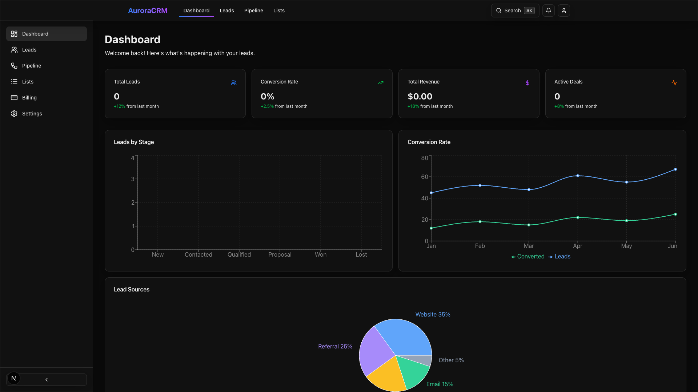
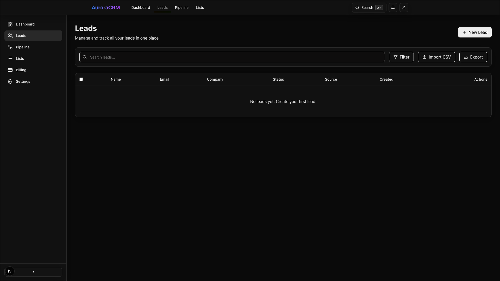
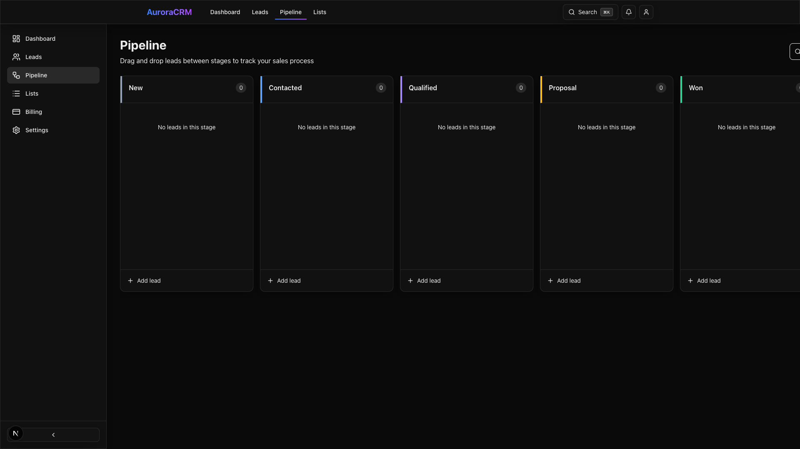
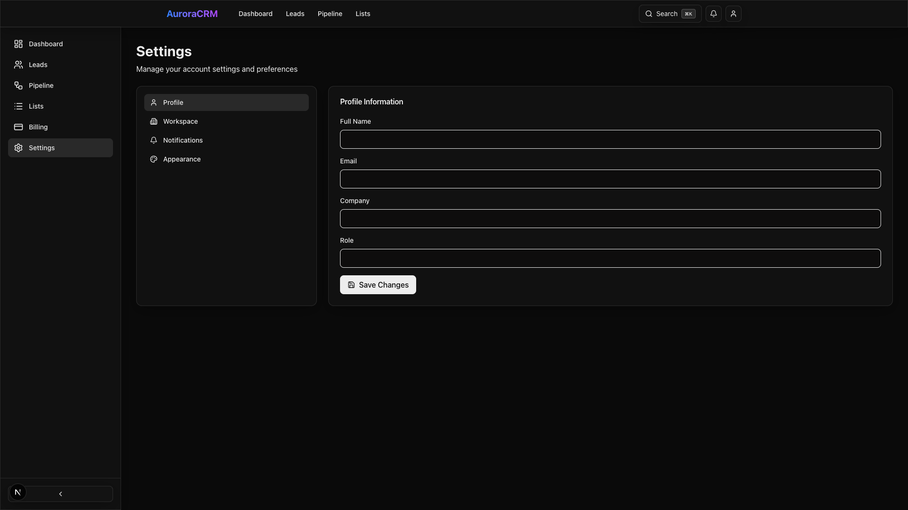

# AuroraCRM

A Minimalist, Glassy, Elegant CRM for Modern Teams

## Overview

AuroraCRM is a lightweight, elegant CRM built for freelancers, startups, small teams, and creators who want a frictionless interface for managing their relationships, pipelines, and leads.

## Features

### ✅ Core Modules (MVP)

- **Authentication** - Login, Signup, and Password Reset flows with glassy UI
- **Dashboard** - Analytics dashboard with charts (bar, line, pie) showing leads by stage, conversion rates, and lead sources
- **Leads Management** - Full CRUD operations with table view, search, filtering, and bulk actions
- **Pipeline/Kanban** - Drag-and-drop kanban board for managing leads through sales stages
- **Lists** - Custom lead lists for organizing and grouping leads
- **CSV Import** - Import leads from CSV files with column mapping
- **Billing** - Subscription management with plan selection and usage tracking
- **Settings** - Profile, workspace, notifications, and appearance settings

### 🎨 Design Features

- **Glassy UI** - Frosted glass morphism design with backdrop blur
- **Smooth Animations** - Framer Motion powered micro-interactions
- **Responsive Layout** - Works beautifully on all screen sizes
- **Dark Mode Support** - Automatic theme detection with manual override
- **Minimalist Aesthetics** - Clean, breathable design with lots of whitespace

## Screenshots

### Dashboard


### Leads Management


### Pipeline Board


### Settings


## Tech Stack

- **Framework**: Next.js 16 with React 19
- **Styling**: Tailwind CSS v4 with custom glass morphism utilities
- **Animations**: Framer Motion
- **Charts**: Recharts
- **Forms**: React Hook Form with Zod validation
- **State Management**: Zustand
- **Icons**: Lucide React
- **CSV Parsing**: PapaParse
- **TypeScript**: Full type safety

## Getting Started

### Installation

```bash
npm install
```

### Development

```bash
npm run dev
```

Open [http://localhost:3000](http://localhost:3000) in your browser.

### Build

```bash
npm run build
npm start
```

## Project Structure

```
/app
  /(auth)          # Authentication pages
    /login
    /signup
  /(dashboard)     # Protected dashboard routes
    /dashboard     # Analytics dashboard
    /leads         # Leads management
    /pipeline      # Kanban board
    /lists         # Custom lists
    /billing       # Subscription management
    /settings      # User settings
/components
  /ui              # Reusable UI components
  /layout          # Layout components (Navbar, Sidebar)
  /leads           # Lead-specific components
  /pipeline        # Pipeline/Kanban components
/lib
  /store.ts        # Zustand state management
  /utils.ts        # Utility functions
```

## Key Components

### UI Components
- `Button` - Multiple variants (default, outline, ghost, glass)
- `Input` - Styled form inputs
- `Card` - Glass morphism cards
- `Modal` - Animated modals with backdrop blur
- `Toast` - Elegant notification system

### Layout Components
- `Navbar` - Top navigation with active state indicators
- `Sidebar` - Collapsible sidebar navigation

### Feature Components
- `LeadForm` - Create/edit lead form
- `CSVImport` - CSV file import with column mapping
- `KanbanColumn` - Pipeline stage columns
- `LeadCard` - Draggable lead cards

## State Management

The app uses Zustand for global state management. The store includes:

- Leads data
- Pipeline stages
- Lists
- Current user
- Theme preferences

## Design System

### Colors
- Neutral palette with ice greys
- Soft gradients (blue to purple)
- Glass morphism backgrounds with backdrop blur

### Typography
- Inter font family
- Thin, clean typography
- Proper hierarchy with font weights

### Animations
- Smooth transitions (200-300ms)
- Physics-based easing
- Micro-interactions on hover and interaction

## Backend & Services Integration

### 1. Firebase (Backend & Auth)

#### Setup
1. Create a project at [console.firebase.google.com](https://console.firebase.google.com)
2. Add a Web App to get your config (`apiKey`, `authDomain`, etc.)
3. Store config in `.env.local`:
   ```env
   NEXT_PUBLIC_FIREBASE_API_KEY=...
   NEXT_PUBLIC_FIREBASE_AUTH_DOMAIN=...
   NEXT_PUBLIC_FIREBASE_PROJECT_ID=...
   ```

#### Authentication
- Enable **Authentication** in Firebase Console.
- Enable **Google** and **Email/Password** providers.
- Use `firebase/auth` for client-side persistence.

#### Firestore Schema
Enable **Cloud Firestore** in test/production mode.

**Users Collection (`users`)**
```typescript
interface User {
  id: string;             // Auth UID
  email: string;
  name: string;
  avatarUrl?: string;
  workspaceId: string;    // Link to workspace
  role: 'owner' | 'member';
  createdAt: Timestamp;
}
```

**Workspaces Collection (`workspaces`)**
```typescript
interface Workspace {
  id: string;
  ownerId: string;
  name: string;
  plan: 'free' | 'pro' | 'enterprise';
  stripeCustomerId?: string;
  subscriptionStatus?: 'active' | 'past_due' | 'canceled';
  createdAt: Timestamp;
}
```

**Leads Collection (`leads`)**
```typescript
interface Lead {
  id: string;
  workspaceId: string;    // Partition by workspace
  name: string;
  email: string;
  company: string;
  status: 'new' | 'contacted' | 'qualified' | 'proposal' | 'negotiation' | 'closed';
  value: number;
  ownerId: string;        // Assigned user
  tags: string[];
  createdAt: Timestamp;
  updatedAt: Timestamp;
}
```

**Activity Logs (`activities`)**
```typescript
interface Activity {
  id: string;
  leadId: string;
  userId: string;
  type: 'note' | 'email' | 'call' | 'status_change';
  content: string;
  createdAt: Timestamp;
}
```

### 2. Stripe (Payments)

#### Setup
1. Create account at [dashboard.stripe.com](https://dashboard.stripe.com)
2. Get API keys (Publishable, Secret, Webhook Secret).
3. Add to `.env.local`:
   ```env
   NEXT_PUBLIC_STRIPE_PUBLISHABLE_KEY=...
   STRIPE_SECRET_KEY=...
   STRIPE_WEBHOOK_SECRET=...
   ```

#### Product Configuration
1. Create Products/Products in Stripe (e.g., "Pro Plan").
2. Create Prices (recurring monthly/yearly).
3. Store `price_id` in your app constants or remote config.

#### Integration Flow
1. **Checkout**:
   - User clicks "Upgrade".
   - App calls API route `/api/stripe/checkout`.
   - API creates Stripe Checkout Session (mode: `subscription`) with `metadata: { workspaceId }`.
   - Redirect user to Stripe-hosted page.

2. **Webhooks**:
   - Create API route `/api/stripe/webhook`.
   - Listen for:
     - `checkout.session.completed`: Update workspace to `pro`, save `stripeCustomerId`.
     - `invoice.payment_failed`: Downgrade or notify user.
     - `customer.subscription.deleted`: Remove access.

## Future Enhancements

- [ ] Real-time collaboration
- [ ] Email integration
- [ ] Tasks and reminders
- [ ] Company records
- [ ] Automated workflows
- [ ] API access
- [ ] Mobile app
- [ ] AI lead scoring

## Notes

- The drag-and-drop in the Pipeline module uses Framer Motion's drag API. For production, consider using a dedicated drag-and-drop library like `@dnd-kit` for better cross-browser compatibility.
- Authentication is currently simulated. Integrate with your preferred auth provider (Supabase Auth, NextAuth, etc.) for production.
- Data persistence is handled in-memory via Zustand. Connect to Supabase or your preferred database for production.

## License

MIT
